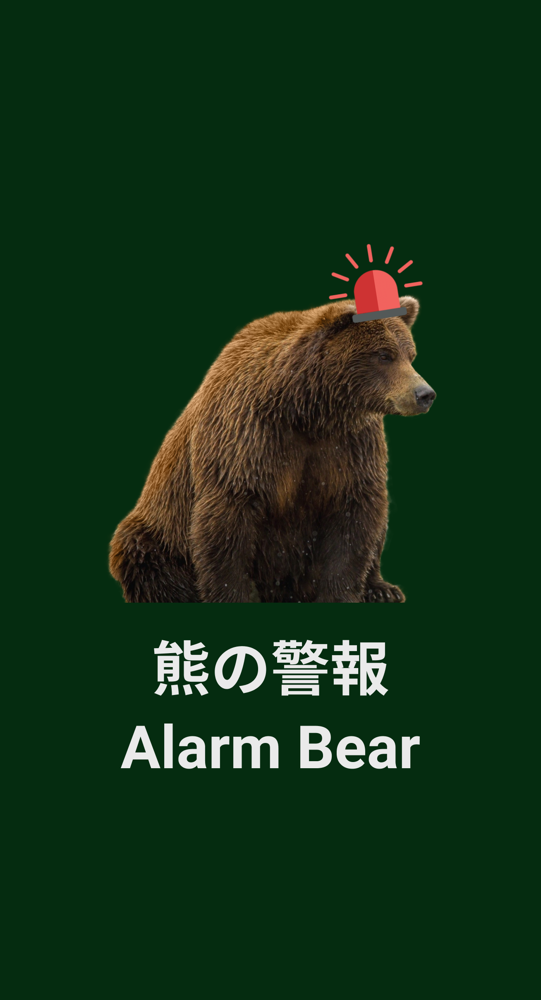
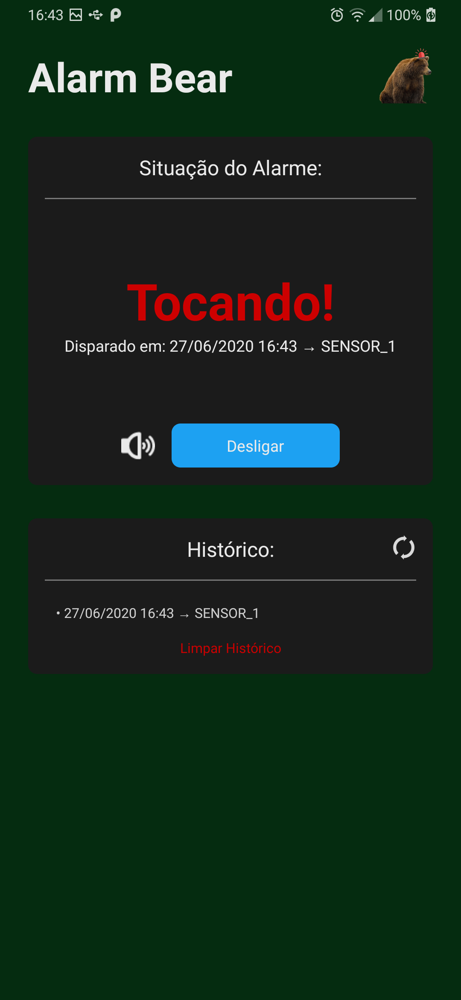

<h1 align="center">
 
  
 
 
Alarm Bear

</h1>

Aplicativo de alame IoT para residências.

  
  
Splash Screen

  
  
Tela principal

## Tecnologias utilizadas 🛠

Esse projeto foi desenvolvido com as seguintes tecnologias de programação:

- ✔️ Typescript

- ✔️ React Native

- ✔️ ContextApi

- ✔️ Axios

- ✔️ Android Push Notifications - FCM

- ✔️ Firebase Realtime Database

- ✔️ Arduino IDE

Feito por Gustavo Kumasawa :wave: [ Entrar em contato](https://www.linkedin.com/in/gustavo-kumasawa-0b2252173/)